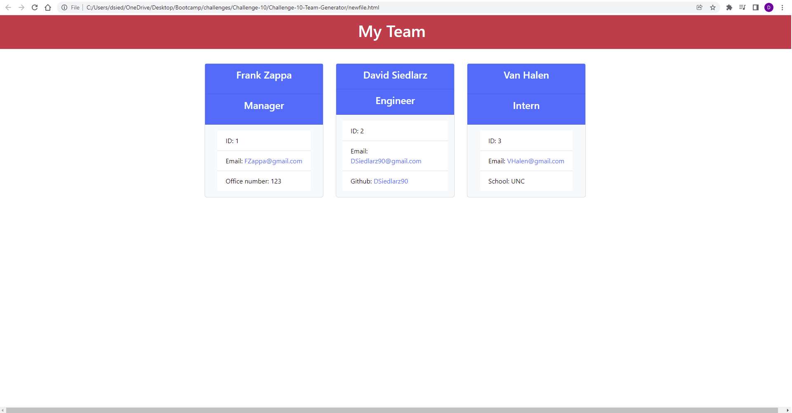

  # Challenge 10 Team Generator

  

  ## Table of Contents
  * [Return to Top](#)
  * [Application Description](#application-description)
  * [Application Installation](#application-installation)
  * [How to Use](#how-to-use)
  * [Application Built With](#application-built-with)
  * [Screenshot](#screenshot)
  * [Github Info](#github-info)
  * [Contact](#contact)
  
  ## Application Description
  This application was designed to help keep track of the members within your team, and provides quick acces to their github profiles, email, id numbers, names, ETC.
  
  ## Application Installation
  To install this project: 
  * Go to the github directory.
  * Clone the directory to your computer
  
  Install these packages/programs as needed:
  * Node.js
  * Jest.js
  * Inquirer.js
  * VSCode(Recommended)
  * Git Bash(Recommended)
  
  ## How to Use
  To use: 
  * Install to your computer. 
  * Navigate to your download location in your preferred terminal. 
  * Run program by typing "node index" into your terminal. 
  * Follow the prompts in the terminal. 
  * Find the output within the dist folder named "index.html". 
  * Open the file in your default browser. 
  * All links should be clickable as necessary.

  ## Demo videos
  Link to watch application demo Video: https://watch.screencastify.com/v/cQHXIghyqFDZPEZNzfTp

  Link to watch test demo Video: https://watch.screencastify.com/v/xWxaLAiEEu5tsafnrqqI

  ## Application Built With
   HTML, CSS, JavaScript, Node.js
  
  ## Screenshot
  

  
  ## Testing
  To test this program:
  * Navigate in terminal to file location
  * Type "npm test" into your terminal and press enter

  ## Github Info
  Github Username: Dsiedlarz90

  Github Profile Link: www.github.com/Dsiedlarz90

  ## Contact
  If you have any questions or concerns please reach out at:

  [DSiedlarz90@gmail.com](mailto:DSiedlarz90@gmail.com)

  
  
  